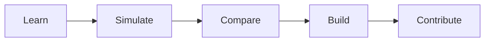

import ProjectTagline from "/snippets/project-tagline.mdx";
import NextStepsCta from "/snippets/next-steps-cta.mdx";
import { oneLinePitch, shortDescription } from "/snippets/project-variables.mdx";

# StackLab

<ProjectTagline />

{oneLinePitch}

{shortDescription}

## What StackLab Is

StackLab is a documentation-first, simulation-minded software engineering platform. It is designed to help developers move from passive reading to practical understanding by combining:

- original explanations
- interactive labs
- architecture comparisons
- real-world scenarios
- production-oriented templates

## How StackLab Is Structured

<Columns cols={2}>
  <Card title="Overview" href="/overview/why-stacklab-exists">
    Start with the problem StackLab is solving and the product shape it is aiming for.
  </Card>
  <Card title="Product" href="/product/vision">
    Read the public product vision, feature universe, roadmap, and design principles.
  </Card>
  <Card title="Labs" href="/labs/overview">
    Explore the learning surfaces that cover runtime, systems, data, reliability, and applied architecture.
  </Card>
  <Card title="Templates" href="/templates/overview">
    See how StackLab plans to turn engineering understanding into strong starter templates.
  </Card>
</Columns>

## What Makes It Different

<Tabs>
  <Tab title="Explain">
    StackLab writes original, engineering-first explanations instead of publishing disconnected notes or copy-pasted summaries.
  </Tab>
  <Tab title="Simulate">
    StackLab makes behavior visible. Users should be able to inspect flows, load, failure, and tradeoffs instead of only reading the happy path.
  </Tab>
  <Tab title="Apply">
    StackLab connects learning to production-minded templates, implementation notes, and contributor workflows.
  </Tab>
</Tabs>

<NextStepsCta />
